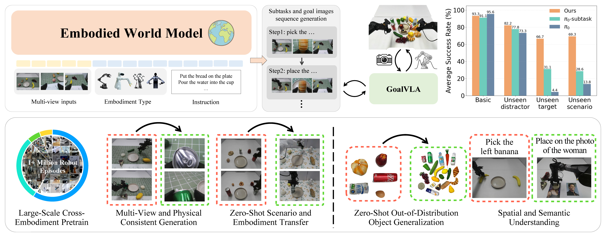

<h1 align="center">
Scaling World Model for Hierarchical Manipulation Policies
</h1>


<p align="center">
  <a href="https://arxiv.org/abs/2602.10983">
    
  </a>
  <a href="https://huggingface.co/vista-wm/vista-wm-ckpt">
    
  </a>
  <a href="https://vista-wm.github.io/">
    
  </a>
</p>

---

## 🧠 Overview
<p align="center">
  
</p>

This repository provides the **official inference code for the embodied world model in VISTA**, introduced in the paper:

> **Scaling World Model for Hierarchical Manipulation Policies**


---

## 📦 Installation

### 1. Clone the Repository

```bash
git clone https://github.com/your-username/your-repo-name.git
cd your-repo-name
```

### 2. Create a Virtual Environment

```bash
conda create -n vista python=3.11 -y
conda activate vista
```

### 3. Install Dependencies

Install required Python packages via pip:

```bash
pip install -r requirements.txt
```

## 🤖 Model Weights

Before running the inference, you need to download the following model weights and place them in the specified paths:

### Step 1: Download VISTA World Model Checkpoint

Download the model checkpoint from Hugging Face and place it in `inference/ckpt`:

```bash
# Install huggingface-hub if not installed
pip install huggingface-hub

# Download model weights
huggingface-cli download vista-wm/vista-wm-ckpt --repo-type model --local-dir inference/ckpt
```

### Step 2: Download IBQTokenizer Weights

Download the IBQTokenizer weights and place them in `inference/IBQTokenizer`:

```bash
huggingface-cli download vista-wm/IBQTokenizer --repo-type model --local-dir inference/IBQTokenizer
```

## 🚀 Launch Gradio Demo

```bash
python app.py
```

## 📝 Prompt Format

The model expects a structured prompt format to enable subtask decomposition and goal image generation.
### Standard Template

```text
Robot Arm Type: {robot arm type}. Instruction: {task instruction}. Finish the task with {n} steps.
```
Supported robot arm types:
- Songling Aloha  
- Songling Aloha Multi View  
- Widow X  
- Google Everyday  
- AgiBot Dual-Arm  
- xArm

Example prompt:
```text
Robot Arm Type: Songling Aloha Multi View. Instruction: put the apple on the plate. Finish the task with 2 steps.
```

### Manual Intervention in Subtask Planning

If the automatically generated subtask plan is suboptimal, the system supports manual subtask specification.

You may directly input subtasks in the "Manual subtask input" field.

Manual subtask input format:
```text
Step 1: pick the apple with the right arm. Step 2: place the apple on the plate using the right hand.
```

This allows users to refine the model’s hierarchical plan in order to obtain the desired goal image generation.

### Multi-View Image Upload Convention

When using multi-view settings (e.g., **Songling Aloha Multi View**), the initial observation images must be uploaded in the following fixed order:

1. Head camera  
2. Left wrist camera  
3. Right wrist camera  

Maintaining this order is required for correct multi-view conditioning of the world model.


